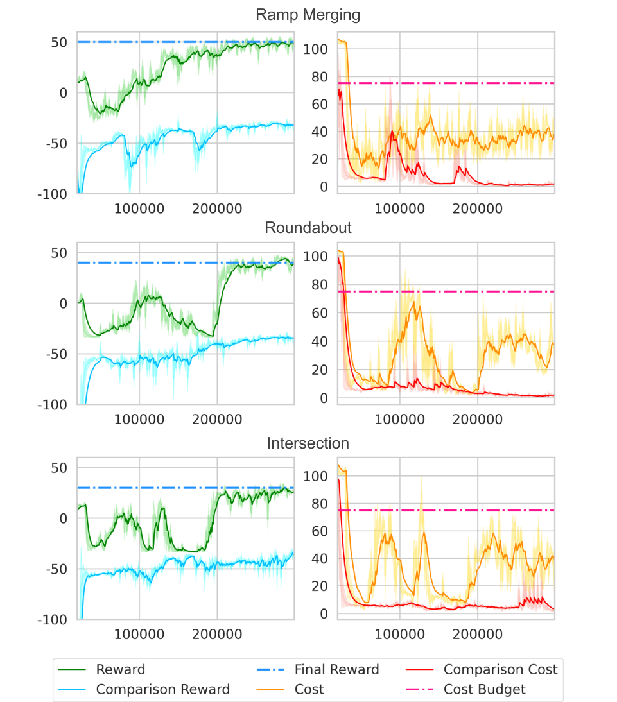
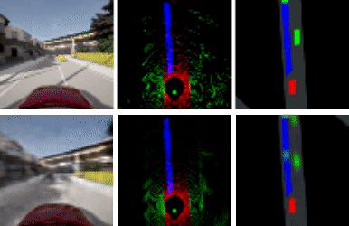
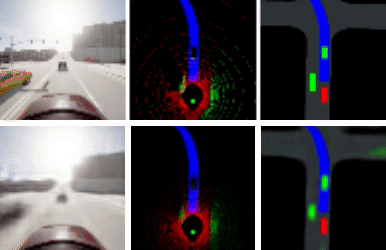
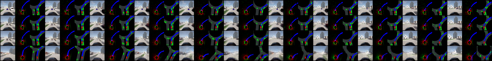

# End-to-end Autonomous Driving With Safety Constraints

This is a PyTorch implementation of "End-to-end Autonomous Driving with Safety constraints" proposed in:

- ["End-to-end Safe Autonomous Driving with Safety constraints" by Changmeng Hou, and Wei Zhang.](https://ieeexplore.ieee.org/document/10679712?source=authoralert)  
  
## Requirements

Ubuntu 20.04  
Carla 0.9.13  
Python 3.7.12  
torch==1.13.1

## Installation

1. Set up conda environment.
```
$ conda create -n env_name python=3.7
$ conda activate env_name
```
2. Clone this git repo to an appropriate folder.
```
$ git clone git@github.com:houchangmeng/safe-e2e-antunomous.git
```
3. Enter the root folder of this repo and install the packages.
```
$ pip install -r requirements.txt
```
4. Train the safe agent .
```
$ python train_safe.py
```

## Result

Results on custom carla reinforcement environment are as follows.



### Ramp merging  


### Roundabout  


### Intersection  


- The first row shows the **ground truth** of camera, lidar, and semantic birdeye images when the trained agent is running in the simulated town with surrounding vehicles and walkers (green boxes).
- The second row shows the **reconstructed** camera, lidar, and semantic birdeye images from the latent state, which is inferred online with the learned sequential latent model.

## Sample a sequence



Sample a sequence of camera, lidar and birdeye images.

- The first row shows the ground truth.
- The secend row shows the posterior sample.
- The third row shows the conditional prior sample.
- The forth row shows the prior sample.
- Left to right indicates flowing time steps.


